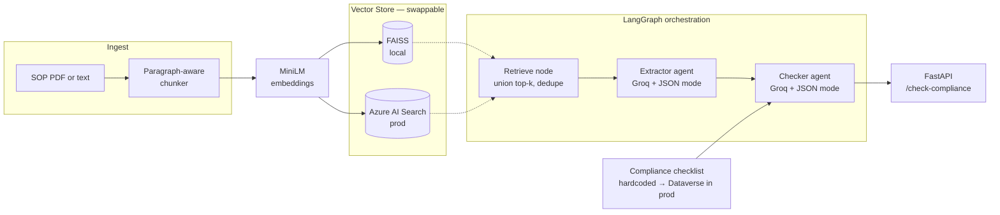

# SOP Compliance Agent

Multi-agent RAG system that **translates regulatory SOPs into structured workflow rules** and checks them against a compliance checklist. Built end-to-end in one evening as a working prototype.

**Stack:** LangGraph · FAISS + Azure AI Search (swappable) · Groq · sentence-transformers · FastAPI · PyMuPDF · Pydantic

---

## What it does

**Input:** an SOP (PDF upload or raw text).

**Output:** structured JSON containing (a) `WorkflowRule` objects extracted from the SOP, each with a `trigger`, `action`, `deadline`, `responsible_party`, and `source_page`, and (b) a compliance check flagging which items in a predefined regulatory checklist are `satisfied`, `partial`, or `missing`, with citations back to the rule IDs that support each verdict.

Example — three sentences of raw SOP text in, six-item compliance verdict out:

```json
{
  "sop_id": "test-sop",
  "n_chunks_indexed": 1,
  "extracted_rules": [
    {
      "rule_id": "R-001",
      "trigger": "investigator becomes aware of an adverse event",
      "action": "report to the sponsor",
      "deadline": "within 24 hours",
      "responsible_party": "principal investigator",
      "source_page": 1
    }
  ],
  "checks": [
    {
      "requirement": "Adverse events must be reported to the IRB within a defined timeframe.",
      "status": "satisfied",
      "evidence_rule_ids": ["R-001"],
      "reasoning": "Rule R-001 requires adverse events to be reported within 24 hours."
    }
  ],
  "summary": { "satisfied": 5, "partial": 0, "missing": 1 }
}
```

---

## Architecture



The vector store is a swappable component. FAISS locally for zero-cost, offline dev; Azure AI Search for production because it handles scale, hybrid search, and integrates with SharePoint via Graph indexers — which is where regulated-industry SOPs actually live. Both backends implement the same `VectorStore` protocol; the API and agents don't know or care which is behind the interface.

The LLM client (`GroqClient`) is similarly abstracted behind an `LLMClient` protocol. Swapping to OpenAI, Azure OpenAI, or Anthropic is a new implementation class, not a rewrite.

---

## Run it

Prerequisites: Python 3.10+, a [Groq API key](https://console.groq.com), and optionally an Azure AI Search resource on the Free tier.

```bash
# Clone and enter
git clone https://github.com/anandh1709/sop-compliance-agent.git
cd sop-compliance-agent

# Set up virtualenv
python -m venv .venv
source .venv/bin/activate            # macOS/Linux
# .venv\Scripts\activate              # Windows

# Install
pip install -r requirements.txt

# Configure — copy the template and fill in your Groq key
cp .env.example .env
# then edit .env

# Drop a sample SOP into data/ (any regulatory PDF works)
# The demo used the Johns Hopkins IRB "Essential SOPs" template.

# Run the API
uvicorn src.api:app --reload --port 8000
```

Then hit http://127.0.0.1:8000/docs for the interactive Swagger UI. The `/check-compliance` endpoint accepts either a PDF upload or raw text via multipart form.

### Backend selection

Set `VECTOR_STORE_BACKEND=faiss` (default) or `VECTOR_STORE_BACKEND=azure` in `.env`. If `azure`, also set `AZURE_SEARCH_ENDPOINT` and `AZURE_SEARCH_KEY`. Same API, same request/response contract, different infrastructure underneath.

### Direct module smoke tests

Each layer has its own smoke test — useful during development or for evaluating what's happening at each stage:

```bash
python -m src.ingest                       # PDF → chunks
python -m src.vectorstore.faiss_store      # ingest → embed → index → query
python -m src.vectorstore.azure_store      # same, against Azure
python -m src.llm.groq_client              # LLM generate + JSON mode
python -m src.rag                          # basic RAG loop, no agents
python -m src.agents.graph                 # full LangGraph orchestration
```

---

## Design decisions & trade-offs

**FAISS + Azure AI Search behind one interface.** FAISS keeps the dev loop tight and CI-friendly (no cloud dependencies to spin up). Azure AI Search gets used for production because it handles hybrid search (BM25 + vector), SharePoint indexer integration via Microsoft Graph, and scale. The `VectorStore` protocol makes the swap a config change.

**Client-side embeddings with MiniLM.** Both backends embed with `sentence-transformers/all-MiniLM-L6-v2` (384-dim). Fast and free during dev; means retrieval quality is identical when swapping backends (proven — Step 2b produces the same top-3 rankings as Step 2a for the same queries). Prod upgrade path: Azure AI Search's integrated vectorisation with Azure OpenAI `text-embedding-3-small` — no client compute, higher quality dimensions.

**Groq's `llama-3.1-8b-instant` for iteration.** Sub-second inference at temperature=0 is what makes multi-agent orchestration usable in a demo. The abstraction lets prod swap to Azure OpenAI GPT-4o or Anthropic Claude Sonnet without touching agent code.

**LangGraph for two nodes.** Arguably overkill — the extractor and checker could be sequential function calls. But making state explicit and typed means adding a third agent later (human-in-the-loop review, a rewriter for ambiguous rules) is a graph edge, not a rewrite. The abstraction earns its keep the moment the graph grows.

**Pydantic validation at every LLM boundary.** JSON mode occasionally produces structurally-wrong output — missing fields, wrong types. Pydantic catches this at the boundary between the LLM and the pipeline, so failures are loud and debuggable rather than silent and downstream.

**Grounding over fluency.** The RAG system prompt explicitly requires the model to say *"the provided SOP does not cover this"* when retrieved context doesn't answer the question. Tested by throwing an out-of-scope medical dosage question at it — the model refused rather than hallucinating a plausible-sounding answer. In regulated contexts, groundedness is worth more than eloquence.

**Hardcoded checklist for the demo.** The compliance checklist is a list of six strings in `src/checklist.py` — drawn from ICH-GCP E6(R2) and 21 CFR Part 312. In production this lives in Dataverse: one row per requirement per market, with severity, framework, and applicable SOP types. The checker pulls the relevant subset at runtime. Same code path.

**Rate-limit awareness.** Hit Groq's free-tier TPM cap during the first end-to-end run. Fixed by (a) capping retrieved chunks at 8 after query-union dedup rather than sending everything, and (b) pacing checker calls with a short sleep. Prod path: paid tier or Azure OpenAI reserved throughput, plus `asyncio.gather` for parallel independent checker calls.

**Deliberately no auth on the API.** This is a prototype; adding OAuth2 / API-key headers is a small step but muddies the demo. In production the API would sit behind Azure API Management or similar.

---

## What I'd do next

Ordered by value, not effort.

- **SharePoint + Microsoft Graph ingestion.** Replace the local `data/sample_sop.pdf` with a Graph API pull from a nominated SharePoint site — customers of the target use case already keep SOPs there. New source, same downstream pipeline.
- **Dataverse sink for extracted rules.** Push the `WorkflowRule` objects to a Dataverse table with columns matching the schema. A Power Automate flow can then route each rule to a reviewer or auto-provision workflow steps in the customer's existing process.
- **Evals with RAGAs.** Build a gold-standard set of SOP → expected-rules and SOP → expected-verdict pairs. Track faithfulness and answer-relevance in CI so retriever + prompt tweaks are safe.
- **Hybrid search on the Azure backend.** Combine BM25 keyword scoring with vector similarity. Azure AI Search does this natively — pass `search_text=query` alongside the vector query. Adds keyword precision without giving up semantic recall.
- **Parallelise the checker.** The six checklist items are independent. `asyncio.gather` cuts wall time roughly 6× on the checker stage. Requires making `LLMClient.generate_json` async.
- **RBAC via Azure Entra ID.** Currently uses admin API keys. Prod would use Managed Identity + the Search Index Data Contributor role — no secrets in `.env`.
- **Dockerise.** One `Dockerfile`, one `docker-compose.yml`, and `docker compose up` boots the whole stack. Cuts prototype deployment time from "clone, venv, install, configure" to a single command.

---

## Project structure

```
sop-compliance-agent/
├── data/                              # SOP PDFs (gitignored)
├── src/
│   ├── config.py                      # env loading
│   ├── ingest.py                      # PDF → paragraph-aware chunks
│   ├── rag.py                         # basic RAG loop (no agents)
│   ├── checklist.py                   # compliance checklist
│   ├── api.py                         # FastAPI service
│   ├── vectorstore/
│   │   ├── base.py                    # VectorStore protocol
│   │   ├── faiss_store.py             # local implementation
│   │   └── azure_store.py             # Azure AI Search implementation
│   ├── llm/
│   │   ├── base.py                    # LLMClient protocol
│   │   └── groq_client.py             # Groq implementation
│   └── agents/
│       ├── schemas.py                 # WorkflowRule, CheckResult, ComplianceReport
│       ├── extractor.py               # Agent 1
│       ├── checker.py                 # Agent 2
│       └── graph.py                   # LangGraph orchestration
├── requirements.txt
├── .env.example
└── README.md
```

---
