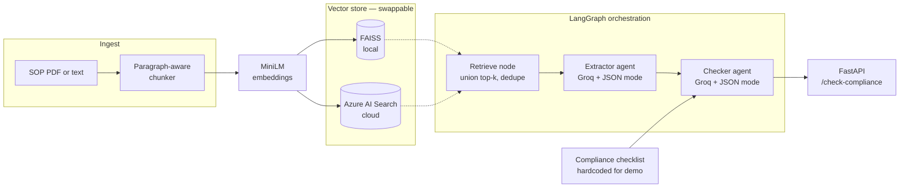

# SOP Compliance Agent

Multi-agent RAG system that extracts structured rules from regulatory Standard Operating Procedures and evaluates them against a compliance checklist. Built as a prototype to explore agent orchestration on domain documents.

**Stack:** LangGraph · FAISS · Azure AI Search · Groq · sentence-transformers · FastAPI · PyMuPDF · Pydantic

---

## What it does

Given an SOP (PDF or raw text), the system:

1. Chunks the document with paragraph-aware splitting
2. Embeds and indexes chunks into a vector store (FAISS locally, or Azure AI Search)
3. Runs a two-agent LangGraph pipeline:
   - **Extractor agent** — reads retrieved chunks and produces structured rules with a `trigger`, `action`, `deadline`, `responsible_party`, and `source_page`
   - **Checker agent** — evaluates each rule against a compliance checklist, returning `satisfied` / `partial` / `missing` with citations back to the rule IDs
4. Serves the whole thing over a FastAPI endpoint with auto-generated Swagger UI

Example response for a three-sentence SOP text sent to `/check-compliance`:

```json
{
  "sop_id": "test-sop",
  "n_chunks_indexed": 1,
  "extracted_rules": [
    {
      "rule_id": "R-001",
      "trigger": "investigator becomes aware of an adverse event",
      "action": "report to the sponsor",
      "deadline": "within 24 hours",
      "responsible_party": "principal investigator",
      "source_page": 1
    }
  ],
  "checks": [
    {
      "requirement": "Adverse events must be reported to the IRB within a defined timeframe.",
      "status": "satisfied",
      "evidence_rule_ids": ["R-001"],
      "reasoning": "Rule R-001 requires adverse events to be reported within 24 hours."
    }
  ],
  "summary": { "satisfied": 5, "partial": 0, "missing": 1 }
}
```

Tested against the Johns Hopkins Medicine IRB "Essential Standard Operating Procedures" template — a real regulatory document with informed consent procedures, adverse event reporting deadlines, drug/device accountability rules, and protocol deviation reporting.

---

## Architecture



The vector store is a swappable component. FAISS runs locally with no external dependencies for offline dev; Azure AI Search is included as an alternative implementation of the same protocol. Both implementations use the same embedding model, so retrieval quality is consistent when swapping — verified during development by comparing the top-3 chunks returned for identical queries across backends.

The LLM client is similarly abstracted behind an `LLMClient` protocol. The current implementation targets Groq; adding another provider would be a new implementation class, not a rewrite.

---

## Run it

Prerequisites: Python 3.10+, a [Groq API key](https://console.groq.com), and optionally an Azure AI Search resource on the Free tier.

```bash
git clone https://github.com/anandh1709/sop-compliance-agent.git
cd sop-compliance-agent

python -m venv .venv
source .venv/bin/activate            # macOS/Linux
# .venv\Scripts\activate              # Windows

pip install -r requirements.txt

cp .env.example .env
# then edit .env with your Groq key (and optionally Azure keys)

# Drop a regulatory SOP PDF into data/sample_sop.pdf
# The demo used the Johns Hopkins IRB Essential SOPs template.

uvicorn src.api:app --reload --port 8000
```

Then hit http://127.0.0.1:8000/docs for the interactive Swagger UI. The `/check-compliance` endpoint accepts either a PDF upload or raw text via multipart form.

### Backend selection

Set `VECTOR_STORE_BACKEND=faiss` (default) or `VECTOR_STORE_BACKEND=azure` in `.env`. If `azure`, also set `AZURE_SEARCH_ENDPOINT` and `AZURE_SEARCH_KEY`. Same API contract, different infrastructure.

### Direct module smoke tests

Each layer has its own runnable smoke test:

```bash
python -m src.ingest                       # PDF → chunks
python -m src.vectorstore.faiss_store      # ingest → embed → index → query
python -m src.vectorstore.azure_store      # same, against Azure
python -m src.llm.groq_client              # LLM generate + JSON mode
python -m src.rag                          # basic RAG loop, no agents
python -m src.agents.graph                 # full LangGraph orchestration
```

---

## Design decisions & trade-offs

**Paragraph-aware chunking, ~500 words with 50-word overlap.** SOP rules typically live inside one or two paragraphs. Fixed-size chunking cuts sentences in half; recursive character splitting can under-chunk headings. Paragraph packing keeps rules semantically whole. The overlap prevents a rule that straddles a boundary from being lost by retrieval.

**Two vector store implementations behind one protocol.** FAISS locally, Azure AI Search in the cloud. Both were exercised end-to-end during development. The abstraction meant the RAG loop, agents, and API were written once and worked against either backend — verified by running the same queries through both stores and comparing rankings.

**Client-side embeddings with `all-MiniLM-L6-v2`.** 384 dimensions, fast on CPU, small enough to cache. Retrieval quality is identical across FAISS and Azure since both embed with the same model. A stronger embedding model (e.g. `bge-large-en-v1.5`) or a domain-specific one would be the obvious quality upgrade.

**Groq's `llama-3.1-8b-instant` for the agents.** Sub-second inference at temperature=0 makes multi-agent orchestration feel snappy in a demo. The `LLMClient` abstraction means swapping to a larger model or a different provider is a config change.

**LangGraph for two agents.** Two nodes could be sequential function calls. Using LangGraph makes state explicit and typed, which pays off the moment the graph grows — adding a third agent (e.g. a rewriter for ambiguous rules, or a human-in-the-loop reviewer) is a graph edge, not a refactor.

**Pydantic validation at every LLM boundary.** JSON mode occasionally produces structurally-wrong output. Pydantic catches this at the boundary between the LLM and the pipeline, so failures are loud and debuggable rather than silent and downstream.

**Grounding over fluency.** The RAG system prompt requires the model to say *"the provided SOP does not cover this"* when retrieved context doesn't answer the question. Tested by throwing an out-of-scope medical dosage question at it — the model refused rather than hallucinating a plausible-sounding answer. In regulated contexts this matters more than eloquence.

**Rate-limit awareness during development.** Hit Groq's free-tier tokens-per-minute cap on the first end-to-end run. Fixed by (a) capping retrieved chunks at 8 after query-union dedup rather than sending everything to the extractor, and (b) pacing the sequential checker calls. Sequential is fine for a demo; the six checker calls are independent so `asyncio.gather` would parallelise them cleanly.

**Deliberately no auth on the API.** This is a prototype focused on the RAG and agent logic. Adding auth would be a separate concern.

---

## What I'd do next

Ordered by value, not effort.

- **Evals.** Build a small gold-standard set of SOP → expected-rules and SOP → expected-verdict pairs, and use RAGAs to track faithfulness and answer relevance across prompt or model changes. Right now iteration is by eyeball.
- **Parallelise the checker.** Six independent LLM calls run sequentially. `asyncio.gather` cuts wall time roughly 6×. Requires making `LLMClient.generate_json` async.
- **Persist FAISS across API restarts.** Currently the store is rebuilt per request. Persist per `sop_id` and reuse across sessions — cuts re-embedding cost for repeat SOPs.
- **Hybrid search on Azure.** Azure AI Search supports combining BM25 keyword scoring with vector similarity in one query. Vector alone can miss the right chunk on rare regulatory phrases; adding BM25 catches those.
- **Streaming responses.** The graph blocks for ~25 seconds. Stream extracted rules as they're produced, then stream check results as they land — LangGraph's `astream_events` covers this without restructuring nodes.
- **Managed Identity for Azure.** Currently uses admin API keys read from `.env`. Managed Identity plus the Search Index Data Contributor role is the production approach — no secrets in env files.
- **Dockerise.** One Dockerfile, one docker-compose file, and `docker compose up` boots the whole stack.

---

## Project structure

```
sop-compliance-agent/
├── data/                              # SOP PDFs (gitignored)
├── src/
│   ├── config.py                      # env loading
│   ├── ingest.py                      # PDF → paragraph-aware chunks
│   ├── rag.py                         # basic RAG loop (no agents)
│   ├── checklist.py                   # compliance checklist
│   ├── api.py                         # FastAPI service
│   ├── vectorstore/
│   │   ├── base.py                    # VectorStore protocol
│   │   ├── faiss_store.py             # local implementation
│   │   └── azure_store.py             # Azure AI Search implementation
│   ├── llm/
│   │   ├── base.py                    # LLMClient protocol
│   │   └── groq_client.py             # Groq implementation
│   └── agents/
│       ├── schemas.py                 # WorkflowRule, CheckResult, ComplianceReport
│       ├── extractor.py               # Agent 1
│       ├── checker.py                 # Agent 2
│       └── graph.py                   # LangGraph orchestration
├── requirements.txt
├── .env.example
└── README.md
```

---
